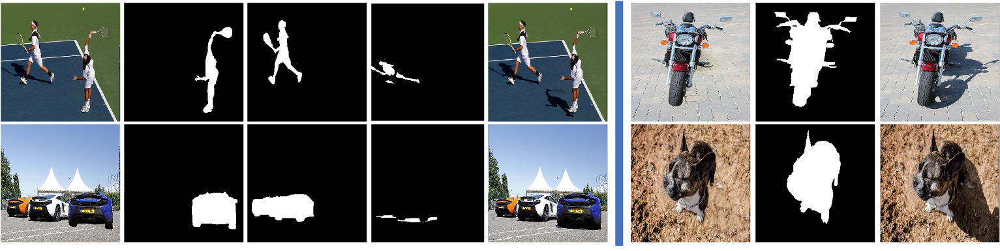

# Object-Shadow-Generation-Dataset-DESOBA


The first dataset on shadow generation for the foreground object in real-world scenes.


**Object Shadow Generation** is to deal with the shadow inconsistency between the foreground ob-ject and the background, that is, generating shadow for theforeground object according to background information, tomake the composite image more realistic.

Our dataset **DESOBA** is a synthesized dataset for Object Shadow Generation. It contains 840 training images with totally 2,999 object-shadow pairs and 160 test images with totally 624 object-shadow pairs.


## Prerequisites

- Linux
- Python 3
- CPU or NVIDIA GPU + CUDA CuDNN

## Getting Started

### Installation

- Clone this repo:

```bash
git clone https://github.com/bcmi/Object-Shadow-Generation-Dataset-DESOBA.git
cd Object-Shadow-Generation-Dataset-DESOBA
```

- Download the DESOBA dataset.

Our DESOBA dataset is available on [**Baidu Cloud**](https://pan.baidu.com/s/12oGrBF88O-x0BlWGVkMjag) (access code: 8q8a), or [**Google Drive**](https://drive.google.com/file/d/114BU47G0OJV3vmx5WKxGnWDSj2Bzh6qS/view?usp=sharing)
