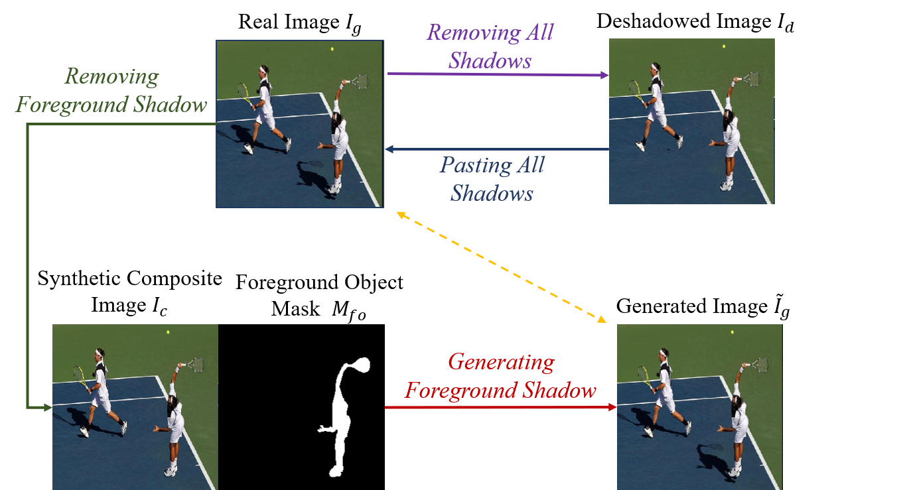

# Object-Shadow-Generation-Dataset-DESOBA



The first dataset on shadow generation for the foreground object in real-world scenes.


**Object Shadow Generation** is to deal with the shadow inconsistency between the foreground object and the background, that is, generating shadow for the foreground object according to background information, to make the composite image more realistic.

Our dataset **DESOBA** is a synthesized dataset for Object Shadow Generation. It contains 840 training images with totally 2,999 object-shadow pairs and 160 test images with totally 624 object-shadow pairs. The DESOBA dataset is provided in [**Baidu Cloud**](https://pan.baidu.com/s/1fYqcSjGSr52jppg2LEA1qQ) (access code: sipx), or [**Google Drive**](https://drive.google.com/file/d/114BU47G0OJV3vmx5WKxGnWDSj2Bzh6qS/view?usp=sharing)


## Prerequisites

- Python 
- Pytorch
- PIL

## Getting Started

### Installation

- Clone this repo:

```bash
git clone https://github.com/bcmi/Object-Shadow-Generation-Dataset-DESOBA.git
cd Object-Shadow-Generation-Dataset-DESOBA
```

- Download the DESOBA dataset.

- We provide the code of obtaining training/testing tuples, each tuple contains foreground object mask, foreground shadow mask, background object mask, background shadow mask, shadow image, and synthetic composite image without foreground shadow mask. The dataloader is available in `/data_processing/data/DesobaSyntheticImageGeneration_dataset.py`, which can be used as dataloader in training phase or testing phase.

- We also provide the code of visualization of training/testing tuple, run:
```bash
python Vis_Desoba_Dataset.py
```
`Vis_Desoba_Dataset.py` is available in `/data_processing/`.
- We show some examples of training/testing tuples in below:


from left to right: synthetic composite image, shadow image, foreground object mask, foreground shadow mask, background object mask, and background shadow mask.
 
